# Assembly log

This document recalls the assembly process. 

## Circuit board

PCB V1.0 (the one without MCU) and PCB V1.1 (all others). 

Most of the passive components are solder by JLC PCB assembly service. 
They can only assemble one side of the PCB, still, it did save a lot of my effort, since searching for components in a box takes much more time than the soldering.  

This side will be faced down when installing to the station. 
This side has ultrasonic transducer drivers, opa-amp, analog switch, barometer/humidity/temp sensor, lightning sensor, voltage regulators, all the connectors, CAN driver, MCU and reset and user buttons. 

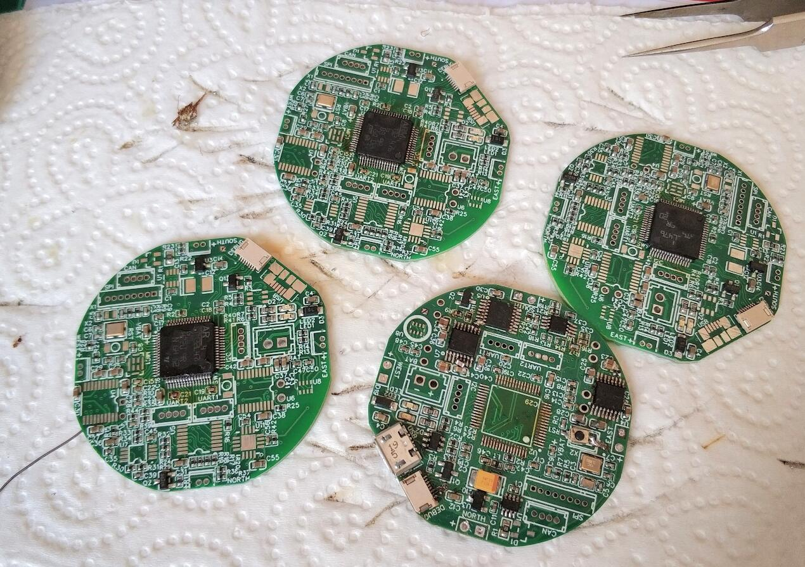

A look from the other side (top). This side includes lightning antenna, IMU, light sensor, IR transmitter and receiver (Rain sensor), GNSS module, SD card slot. 

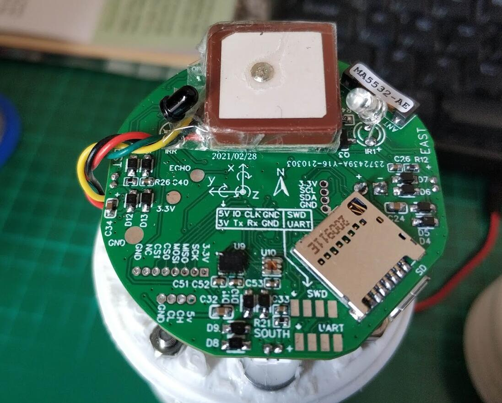

3 PCB assembled with transducers. 

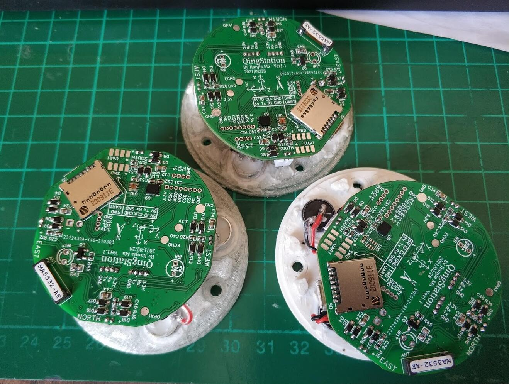

## Transducer assembly

The aluminium transducers are the ones I selected, (40kHz closed-end, waterproof). 
Please see the [anemometer development](anemometer.md) for detail. 

Those black ones are actually open-end transducers. 
It is not waterproof and has a much stronger signal. I am trying to test different transducers. 

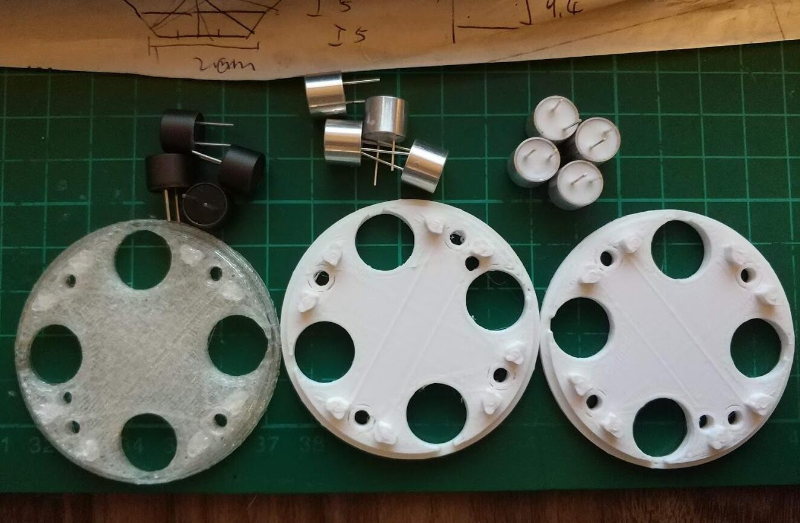

I then sealed the transducer to a 3D printed case with soft silicone glue.   

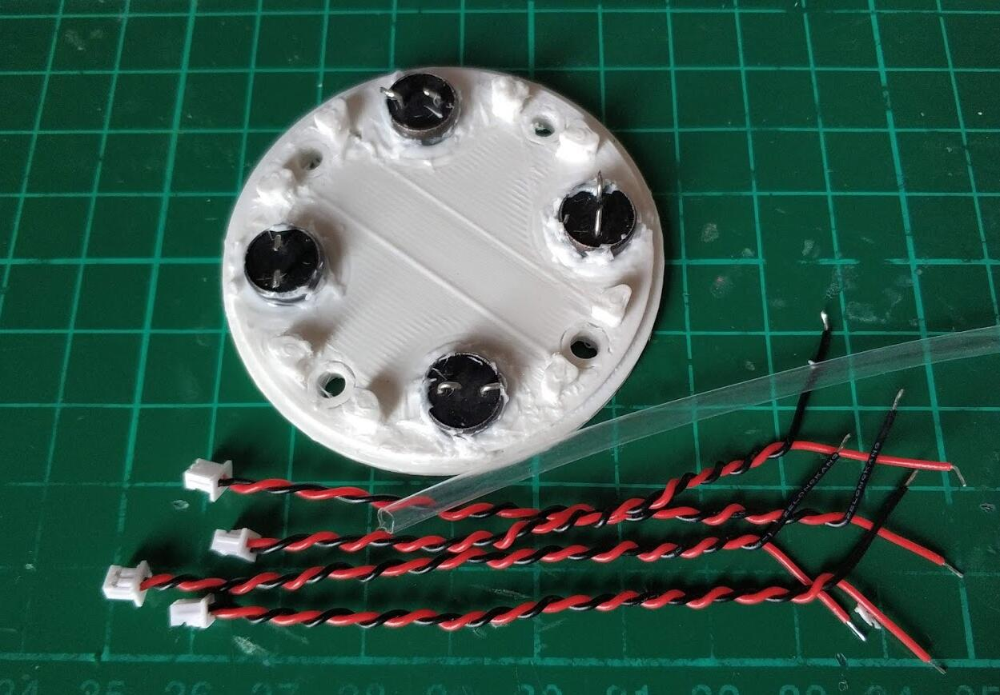

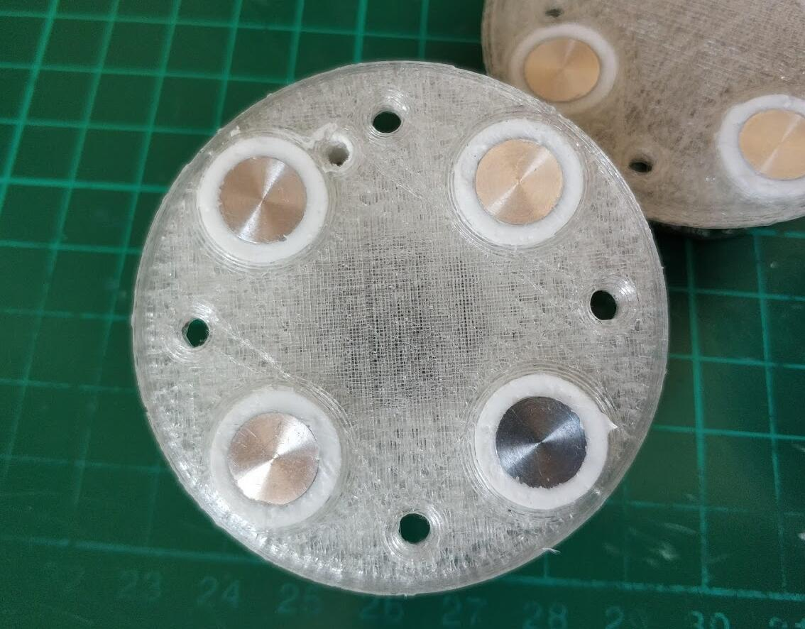

This method is ok to do and it is actually not that difficult to assemble it. 
I first stick a tape to the bottom flat surface, then put the transducer in the mid of the circle. 
Finally, apply the glue and wait for 24 hours.

The raw signal looks quite consistent across the different assembly.

## Assembly

I designed a few different enclosures, but normally I use this one. 

Since the barometer/humidity sensor (BME280) is soldered directly onto the PCB.
The measurement is affected by the PCB board temperatures. 
The PCB temperature is normally 3~5 degree C higher than the room temperature depending on the supply voltage. 
So a bladed enclosure it needed. 
However, this design failed at one of my motorway rain tests. (heavy rain/70mph)

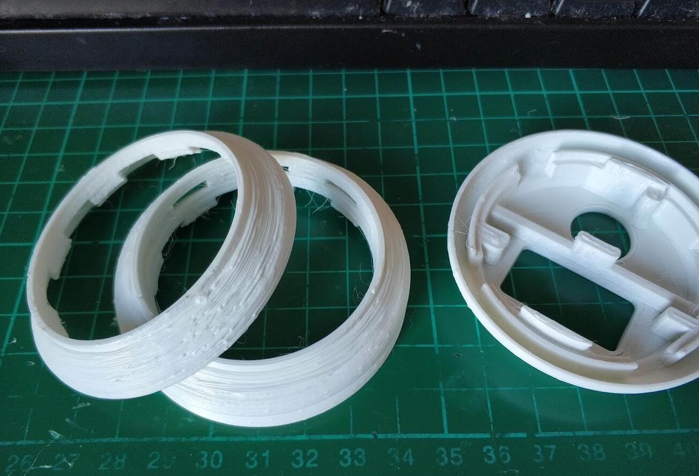

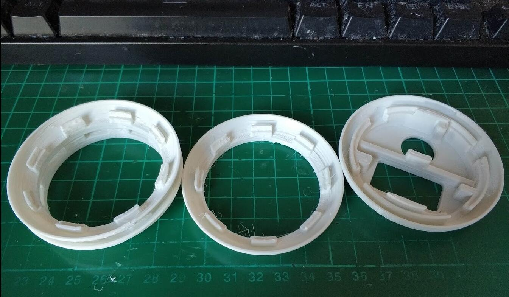

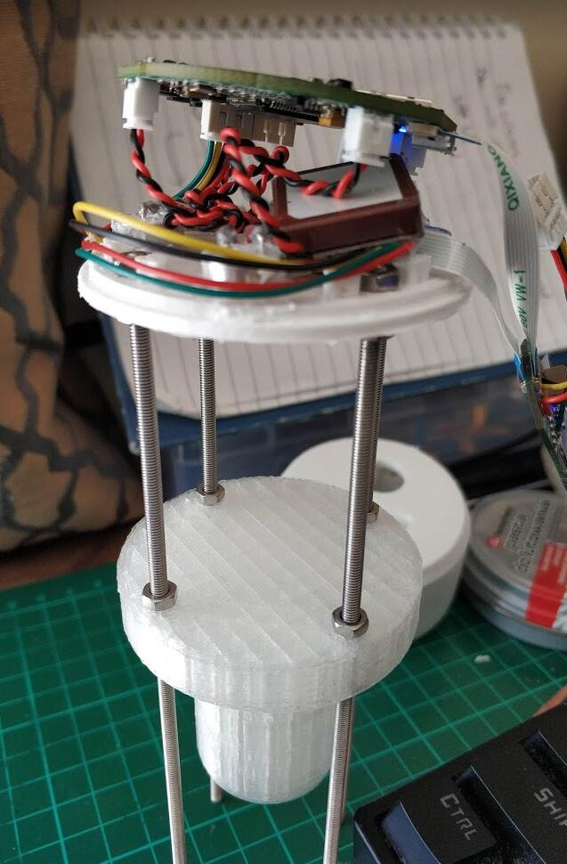

Assembly with Rain sensor lens attached (glued using epoxy)

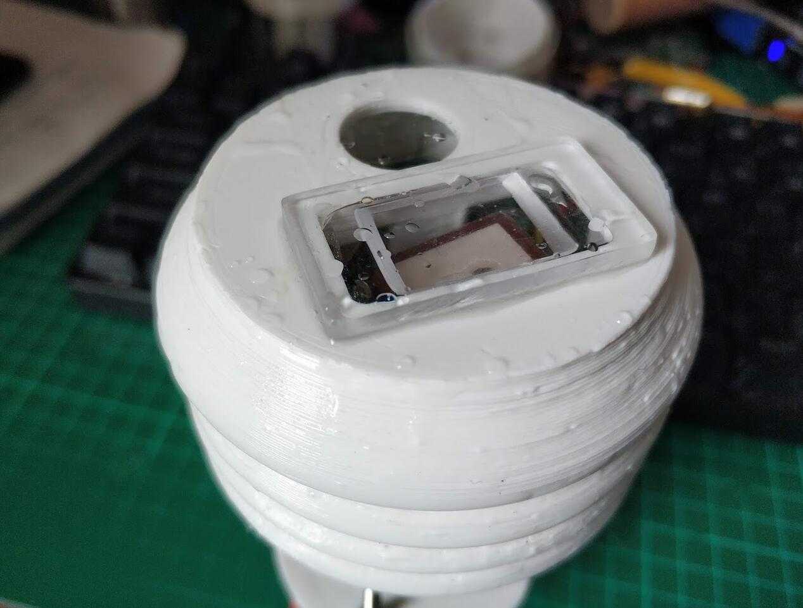

After a rain test. 

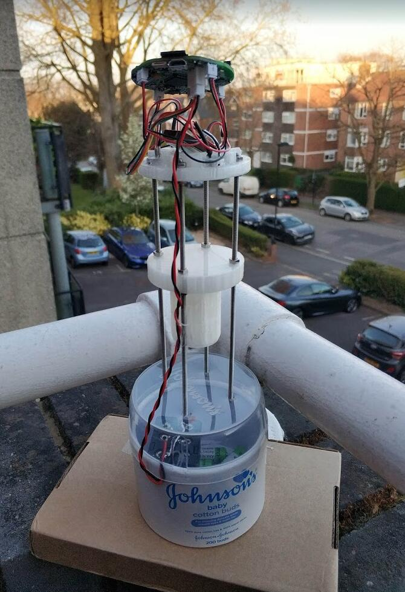

## Solar panels

I try to use a lithium ion battery (18650) to power the device. 
At the very beginning, every IC is working at maximum power, result in an average 150mA total power consumption (QingStation + GNSS module + ESP8266).  
A 18650 only last for a night. 

The panels are rated 12V 160mAh. 
I connected 2 of them in parallel through a Schottky diode to a CN3971 MPPT charger. 
The actual efficiency is another story.  
When the solar panels are laying flat, each of them produces 100mA in the noon. 
The CN3971 only manage to extract 450mA to charge the battery and power the station at 3.7V. 

> This might be related to the sensing resistor in the crappy multimeter I used to measure the current. 
> The actual charging current might be higher. 
> In a sunny day test, it took 8 hours from 7:00 to 15:00 to charge a 2600mAh battery from 3.4V to 4.2V (with 150mA load from the station). 
> I would estimate the average charging current is ~250mA. while the peak we measured is only 300mA (450-150). 
> So the measurement must be wrong. 

Actually, even with the CN3971 has an efficiency factor at only around 0.8, we can still estimate the output from the input. 
As we measured, each solar panel produce 11.5V 0.1A, that is, 2.3W in total. 
The output should be around 2.3x0.7=1.61W. 
When the battery is at 3.7V, the current is 0.49A.

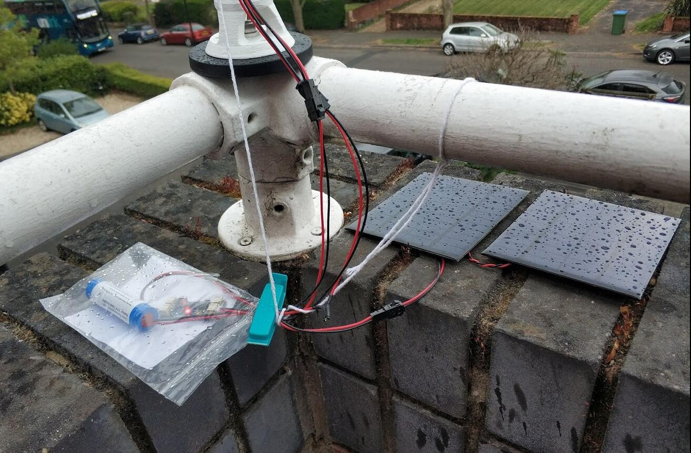

In the dark

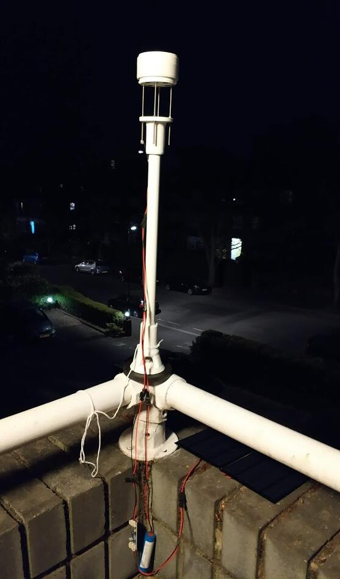

With car magnet car mount

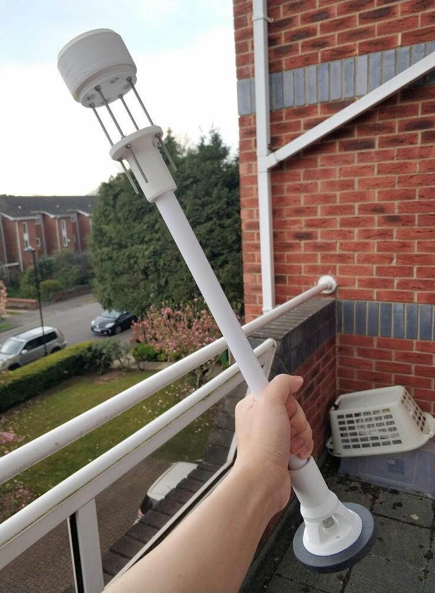

To be continued..

